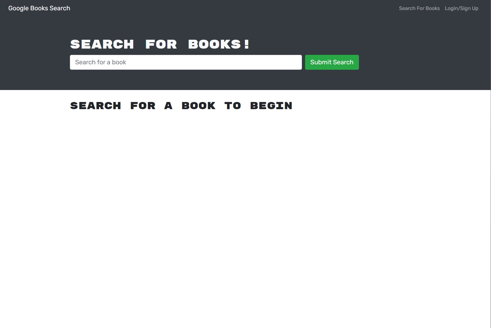
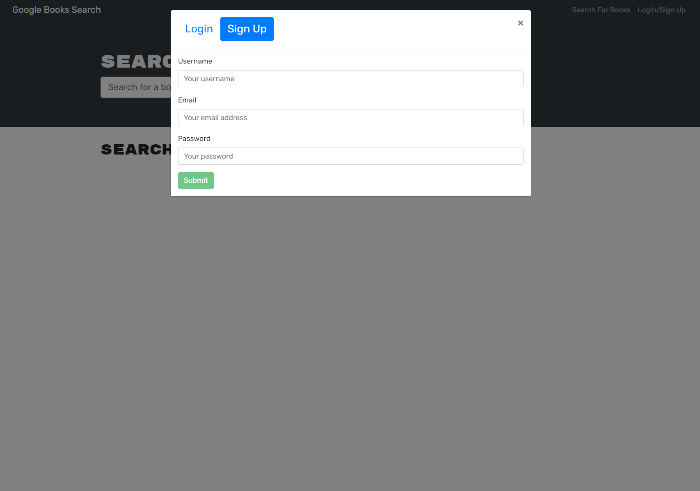
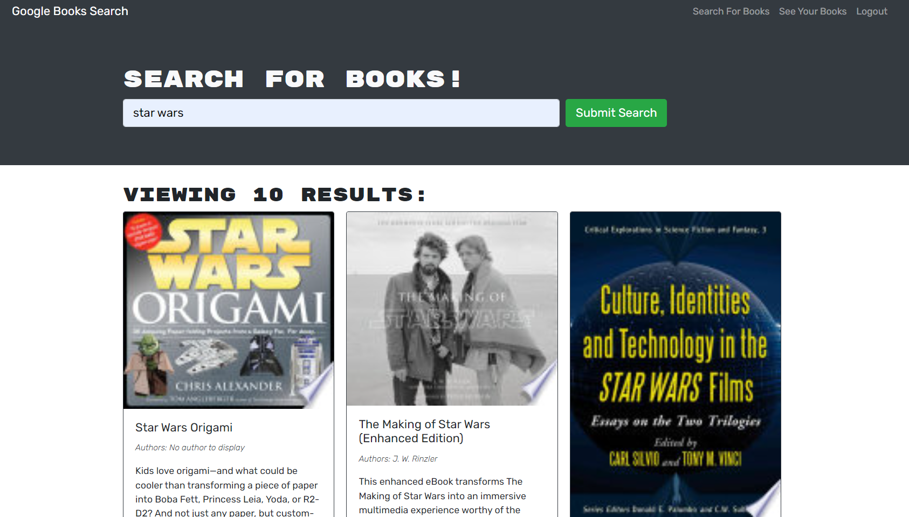

# book-search-engine-mern

A full-stack book search engine app using MERN stack

## Description

This is a full-stack book search engine app using MERN stack. The MERN app was originally a RESTful API app that was converted to use GraphQL and Apollo Server instead. The app uses Google Books API for the search, the user can sign up or login, search for the books and save the books, the user can view saved books in the dashboard and the user can choose to delete books as well. The app uses React for the front-end UI, React router for routing, Express and MongoDB, Mongoose for the back-end. The app also uses the Apollo Server and GraphQL.

_Notice for installing locally_ the packackage.json had to be set to a specific version of node for deploying to Heroku for the build to to run. Depending on your locally installed version of Node.JS you may need to edit this in the package.json at the root of the folder.
It looks similiar to this below:

`"engines": { "node": "16.16.0" },`

## Screenshot(s)

## Link to deployed App

[Deployed app link](https://whispering-bastion-35182.herokuapp.com/)
